# Anomaly Detection of GPS Spoofing Attacks on UAVs  
<p align="center">
    
</p>

System's main goal is to create machine learning models for anomaly detection on UAVs.
The system allows creation and loading of machine learning models by using dynamic inputs. In the next stage, each model will classify anomalies in the test observations. <br/><br/>
Moreover, the system displays different output plots and evaluation metrics which compare between different models and the diagnosis of anomalies which were found.
Running the system with dynamic parameters will allow us to extract many different machine learning models.
Comparing them based on different evaluation metrics will lead to obtaining the best machine learning models for anomaly detection.<br/><br/>
Those models will be used as **a baseline for a real-time & light-weight anomaly detection algorithm based on streaming data from UAV sensors
in to order to get the earliest possible detection of GPS spoofing attacks on UAV’s.**

## Background & Motivation

Various uses of drones can be found in a variety of fields:
* **Agriculture** : accurate and cheap spraying.
* **Security** : used for patrolling and following suspects in real time.
* **Rescue** : locating distressed people.
* **Military** : intelligence operational activities.

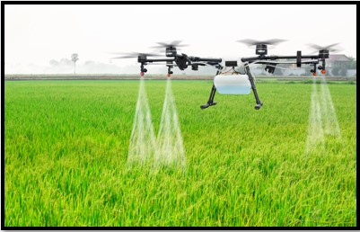

## What is GPS Spoofing ? And how it is harmful?

* Unmanned Aerial Systems (UAS) is vulnerable to different cyber-attacks such as GPS spoofing. In GPS spoofing attack, a malicious user transmits fake signals to the GPS receiver in the UAS.
* GPS spoofing attacks are aimed at stealing or crashing a UAV by misleading it to a different path than the original course planned by the operator.

**Crashed drone**</br>
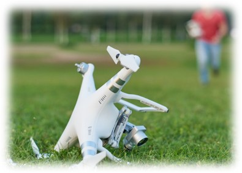
</br>**Kidnapped drone**</br>


## System flow
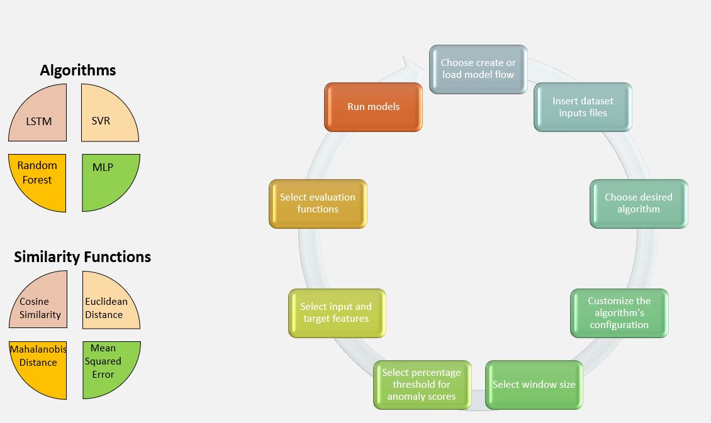

### Prerequisites

You should run the command (before run the system) in the console:

```
pip install -r requirements.txt
```

** See explanation below - Requirements File

## Directories Structure

**Train directory** - should be in th following structure: </br>
Chosen directory will contain:</br>
<\t>-> Route_Name_1</br>
</t>-> without_anom.csv</br>
&nbsp-> Route_Name_2</br>
&nbsp&nbsp-> without_anom.csv</br></br>

**Test directory** - should be in th following structure:</br>
Chosen directory will contain:</br>
    -> Route_Name_1</br>
        -> Attack_Name_1</br>
            -> sensors_0.csv</br>
        -> Attack_Name_2</br>
            -> sensors_0.csv</br>
        -> Attack_Name_3</br>
            -> sensors_0.csv</br>
        -> Attack_Name_4</br>
            -> sensors_0.csv</br>
    -> Route_Name_2</br>
        -> Attack_Name_1</br>
            -> sensors_0.csv</br>
        -> Attack_Name_2</br>
            -> sensors_0.csv</br>
        -> Attack_Name_3</br>
            -> sensors_0.csv</br>
        -> Attack_Name_4</br>
            -> sensors_0.csv </br></br>

**Results directory** - any directory to save all model configurations and results.</br>


## Getting Started

First, you should clone the project to your local environment:

```
git clone https://github.com/liorpizman/AnomalyDetection.git
```

<br/>

Run 'guiController.py' file in order to run the system.<br/>
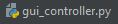

Choose Between two different option:<br/>
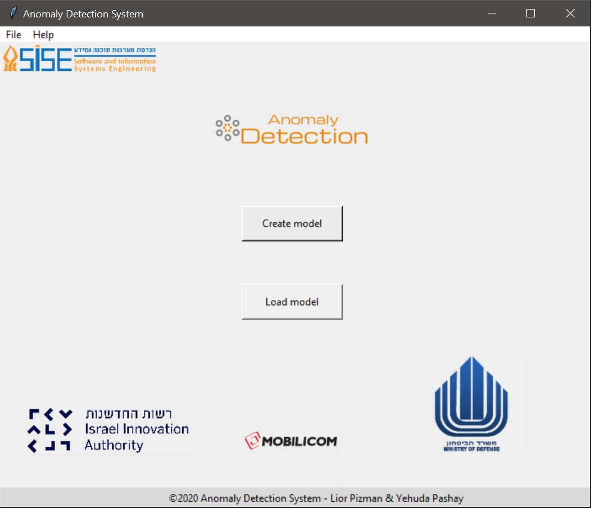

### First Flow - Create new machine learning model

Insert simulated data / ADS-B data set input files<br/>
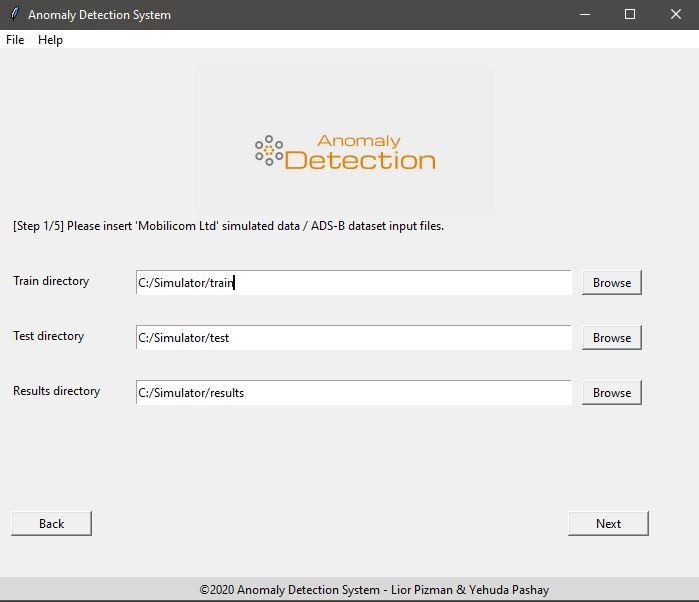

Select algorithms for which you want to build anomaly detection models<br/>
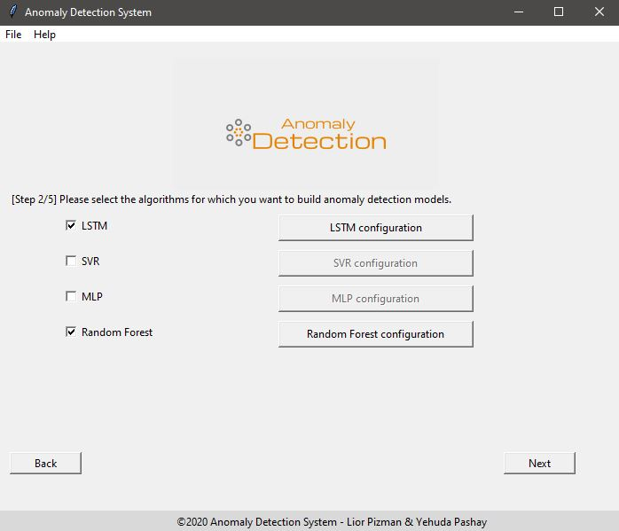

Select the values for each of the following parameters<br/>
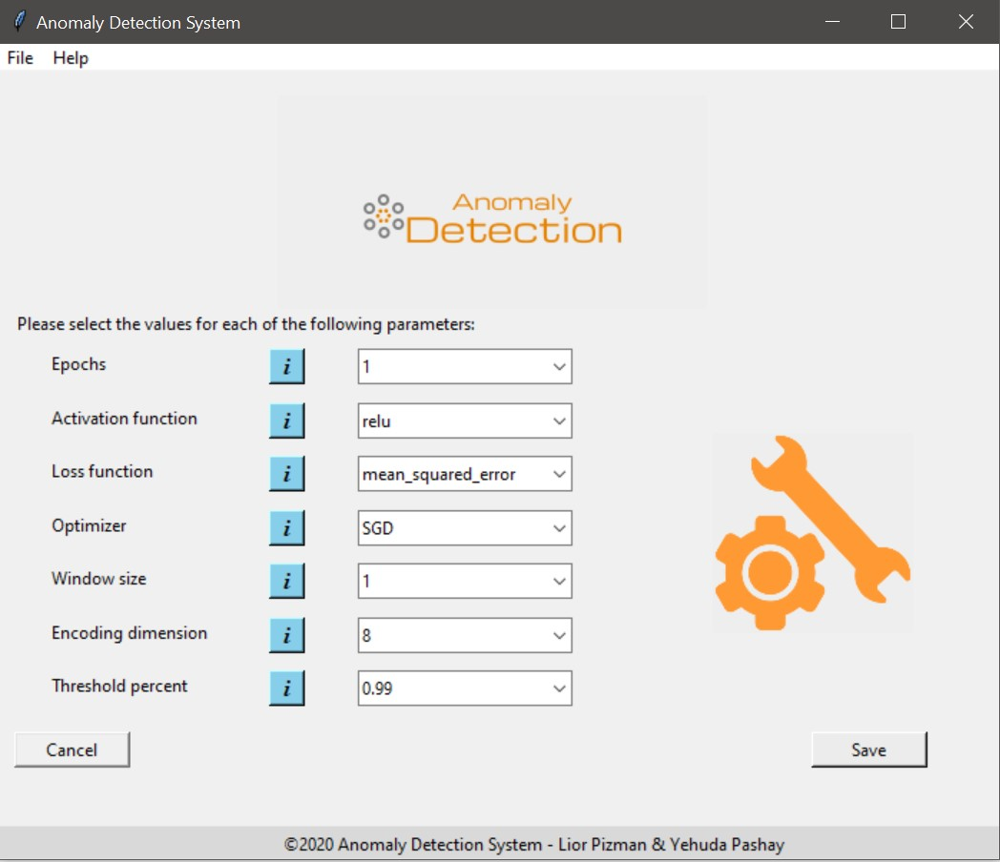

Please choose both input and target features<br/>
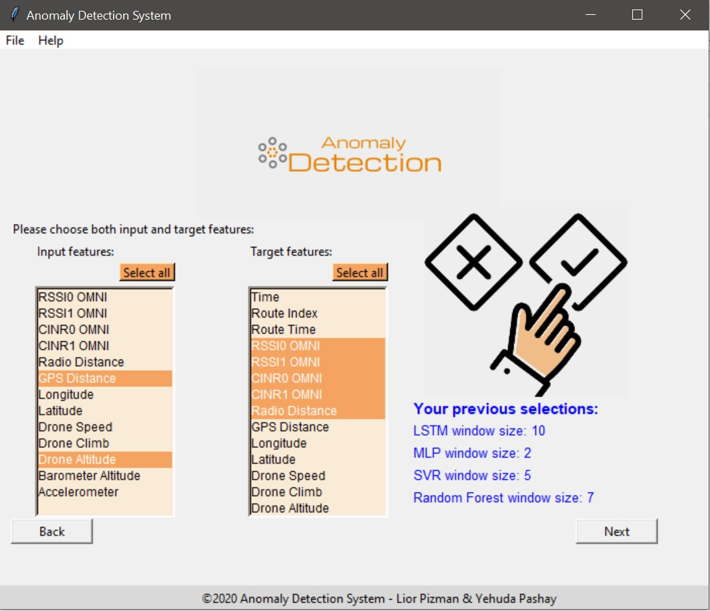

** See next step under the title: Both Flows - similarity functions step

### Second Flow - Load existing machine learning model

Insert input files for existing model<br/>
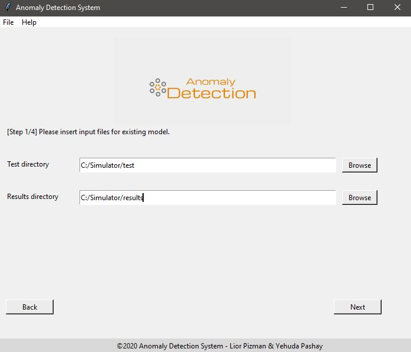

Insert paths for existing models<br/>
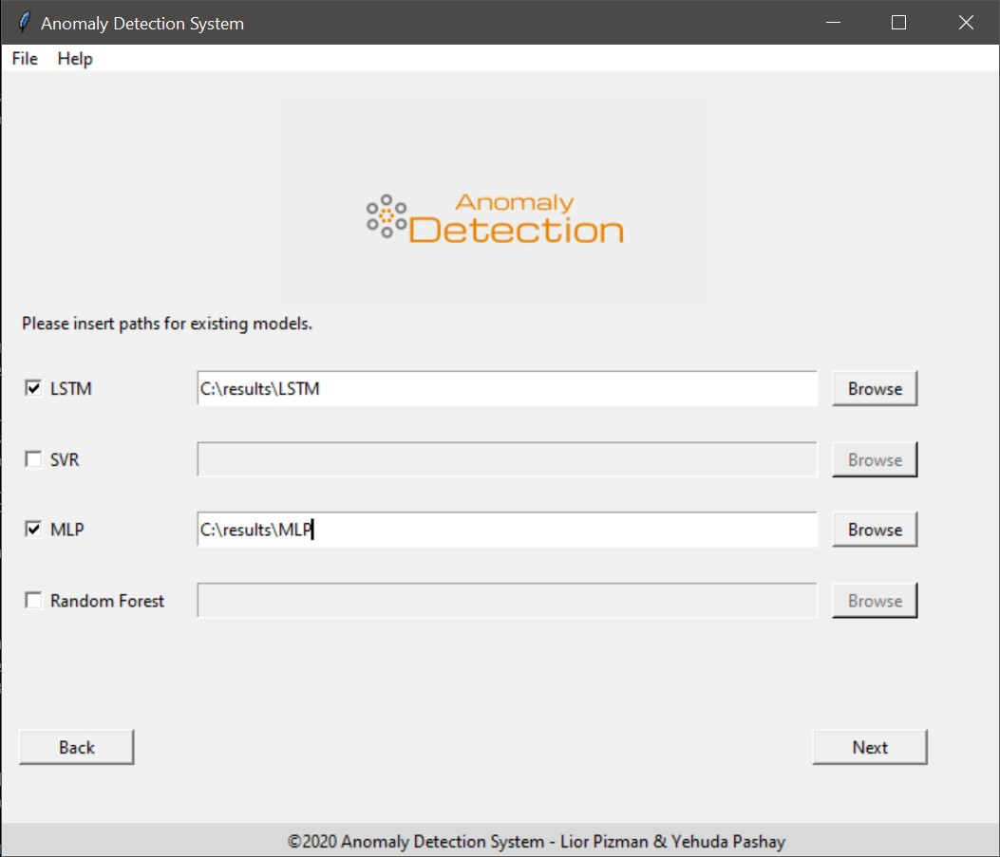

** See next step under the title: Both Flows - similarity functions step

### Both Flows - similarity functions step

Choose similarity functions from the following options<br/>
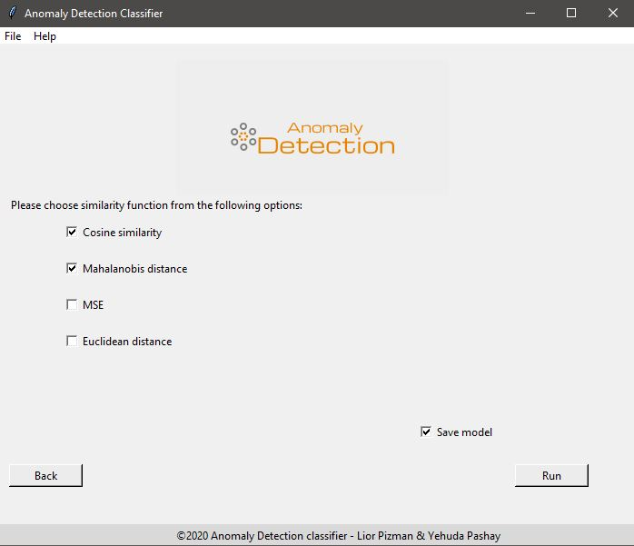

Loading model, please wait...<br/>
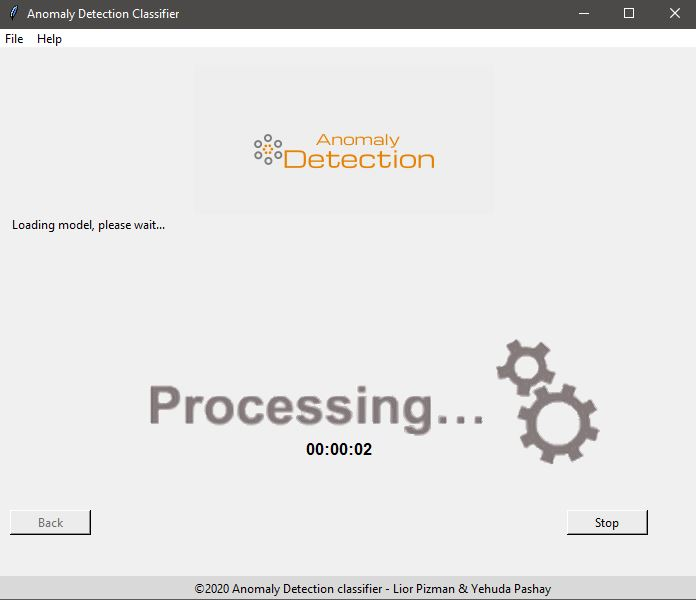

Choose an algorithm and a flight route in order to get the results<br/>
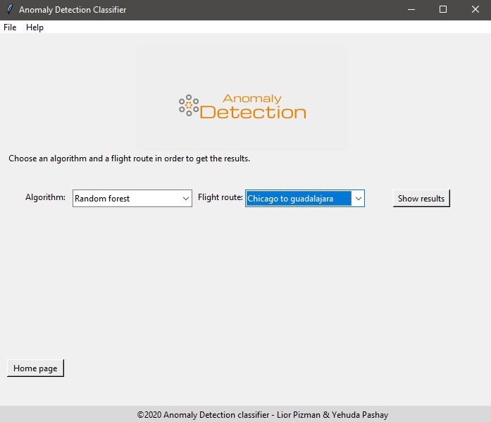

Choose an algorithm and a flight route in order to get the results<br/>
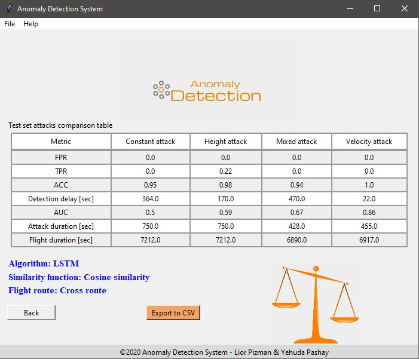

## Generated Machine Learning Models 

* LSTM - Long Short-Term Memory
* SVR - Support Vector Regression
* Random Forest
* MLP Neural Network


| Algorithm | Description |
| -- | -- |
| LSTM | An artificial recurrent neural network (RNN) architecture used in the field of deep learning. |
| SVR | A popular machine learning tool for classification and regression. |
| Random Forest | Are supervised ensemble-learning models used for classification and regression. |
| MLP Neural Network | Multi-layer Perceptron regressor. This model optimizes the squared-loss using LBFGS or stochastic gradient descent.|
<br/>

## Train & Test Explained

| Data Set | Description |
| -- | -- |
| Train Set | Records containing sensors' values ​​for non-anomalous drone flights. |
| Test Set | Records containing sensors' values ​​for flights that have been attacked in various predefined attacks. |
<br/>

## GPS Spoofing Attacks - ADS-B Data Sets

| Attack | Description |
| -- | -- |
| Up attack | Try crushing the drone by changing his height sensor data in the dataset. |
| Down attack | An attempt to raise the drone up and get him out of his real route. |
| Fore attack | Randomly change sensors’ values. |
| Random attack | Injection of real sensors’ data from another flight to current flight. |
<br/>

## GPS Spoofing Attacks - Simulated Data Sets

| Attack | Description |
| -- | -- |
| Constant attack | Constant height and constant velocity. |
| Changing height attack | Constant height and changing velocity. |
| Changing velocity attack | Changing height and constant velocity. |
| Mixed attack | Changing height and changing velocity. |
<br/>

# Time Series Regression

Regression algorithms are not intended for time series predicting. Therefore, in order to make a prediction of a record based on N previous records, we will need to change the data. The data will be changed by taking the previous N records and flattening them into a vector. </br>

Assume that the following data matrix exists: (We will mark each line with different color for convenience)</br></br>
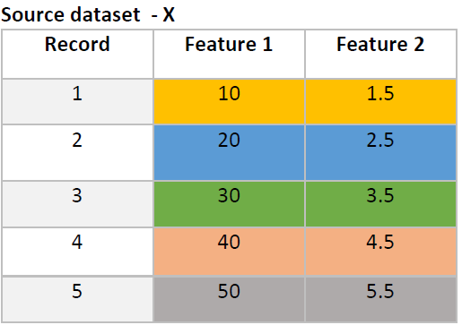</br></br>

Now, let's assume we want to process this matrix to fit time series prediction problem. </br>
We will define the window size to be 2 - that means, each record will be predicted by using **2** previous records.</br>
**For example**: to predict the fourth record, we need to use records 2 and 3.</br>
In order to do it, we should combine each record with the following record - that means, combine records 1 and 2, combine records 2 and 3, and combine records 3 and 4. </br>
</br>The following table will be used as **training vectors**: </br></br>
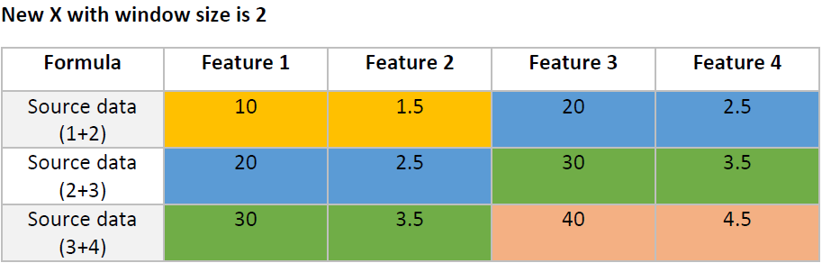</br>

The **training vectors** should look like this:</br></br>
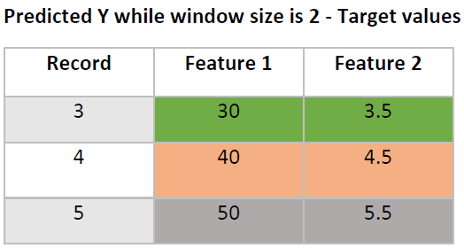</br>

**Another example with window size = 3** </br></br>
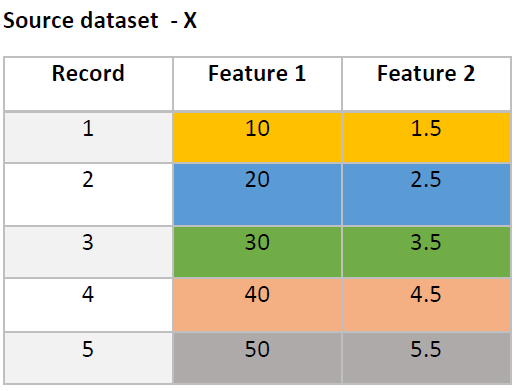</br></br>
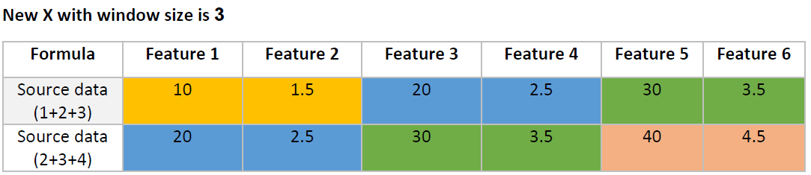</br></br>
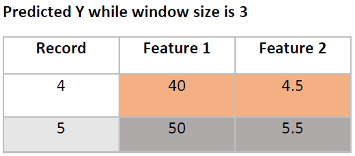

# Metrics Comparison Results Table

**Example:**<br/>
Algorithm: Random Forest<br/>
Similarity function: Cosine similarity<br/>
Route: Cross route<br/>
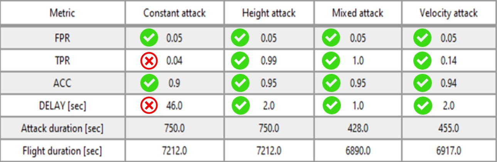

# Outlier Score Testing Results - Visual Illustration

**Normal behavior - green dots**</br>
**Spoofed path - black dots**

## LSTM - Results Example 

**Good model prediction example:**<br/>
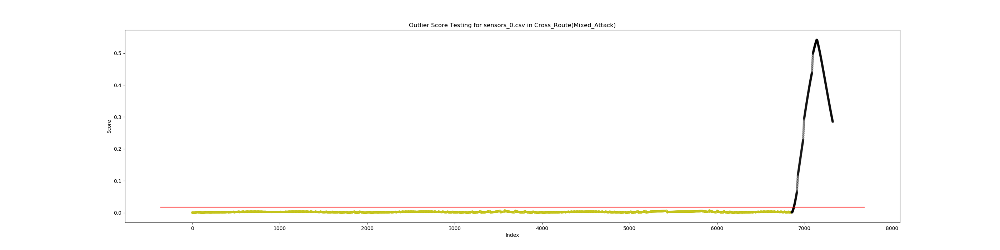

**Bad model prediction example:**<br/>
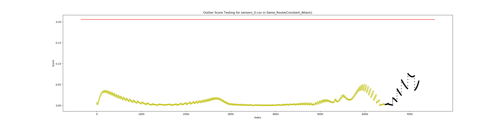

## SVR -  Results Example 

**Good model prediction example:**<br/>
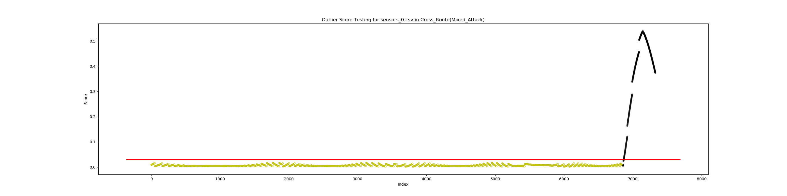

**Bad model prediction example:**<br/>
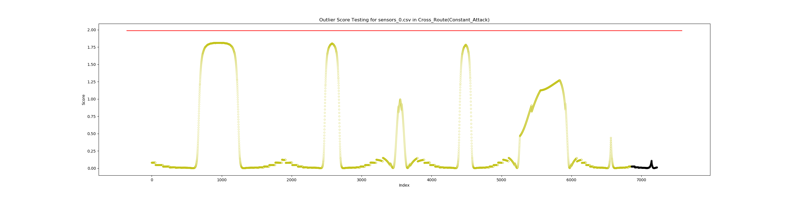

## Random Forest - Results Example 

**Good model prediction example:**<br/>
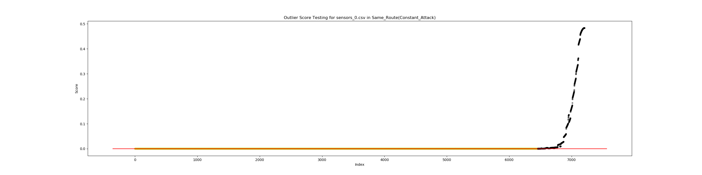

**Bad model prediction example:**<br/>
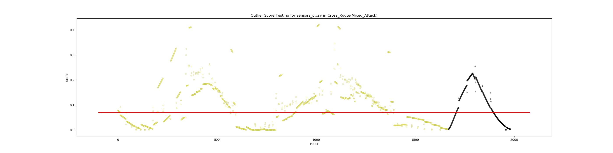

## MLP Neural Network - Results Example 

**Good model prediction example:**<br/>
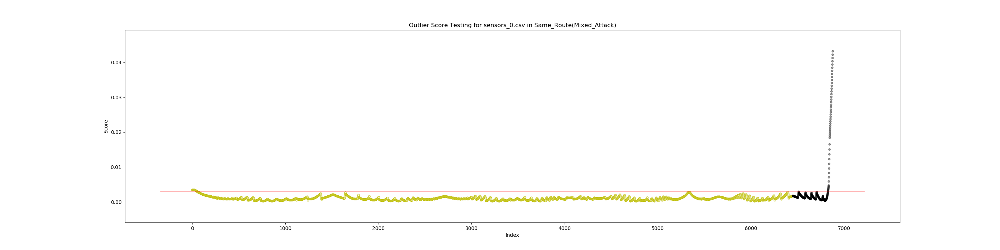

**Bad model prediction example:**<br/>
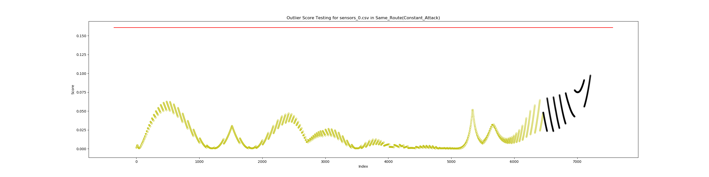

# Sensor value - Actual vs. Predicted - Results - Visual Illustration

## LSTM - Results Example 

**Good test prediction example:**<br/>


**Bad test prediction example:**<br/>
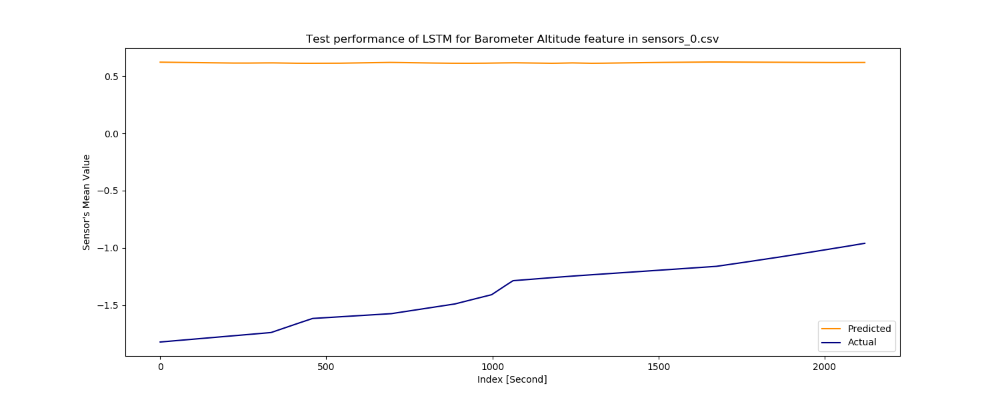

## SVR -  Results Example 

**Good test prediction example:**<br/>
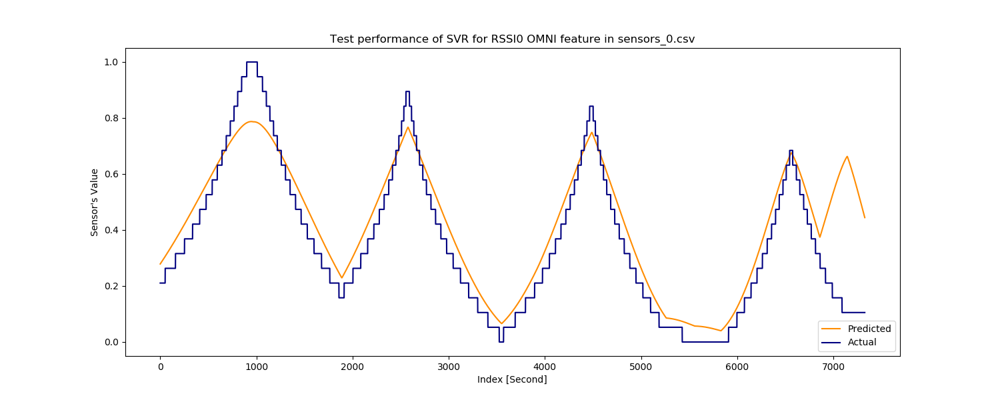

**Bad test prediction example:**<br/>
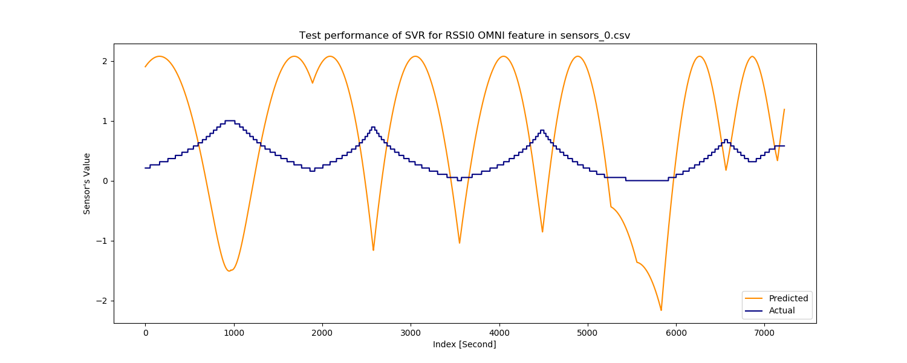

## Random Forest - Results Example 

**Good test prediction example:**<br/>
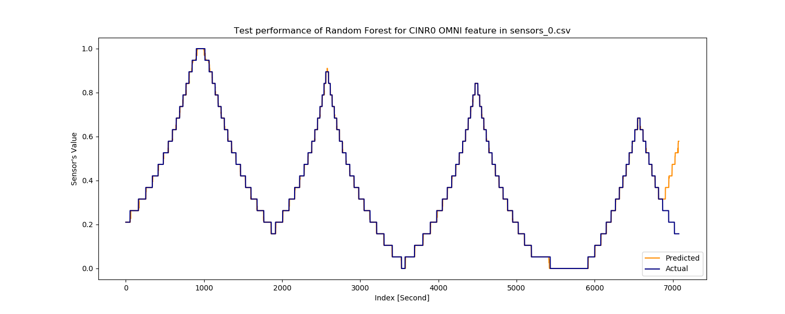

**Bad test prediction example:**<br/>
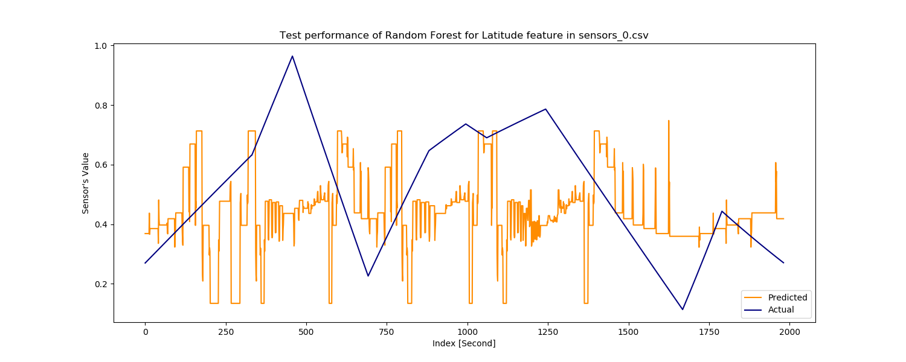

## MLP Neural Network - Results Example 

**Good test prediction example:**<br/>
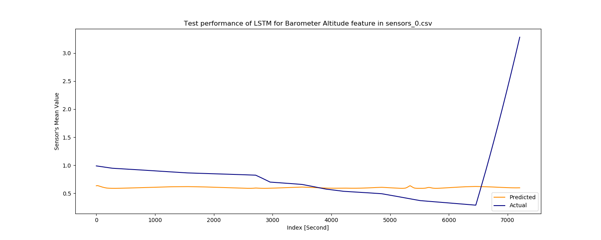

**Bad test prediction example:**<br/>
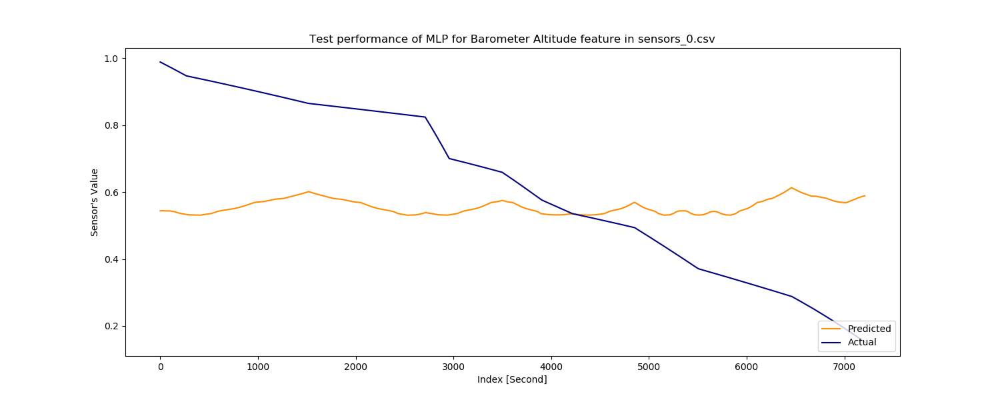

## Research Risks

* **Imbalanced data sets** - the amount of data about attacks is very small compared to drone's regular behavior data.
* **Duration of the attack detection** - the true detection rate of GPS attacks will be high (TPR) but the duration of the attack detection will be long so the drone will be abducted even though the attack was detected.
* **Results expectations** – machine learning models results can be different from our initial expectations.


## Python Libraries We Used

* [Keras](https://keras.io/) - the Python Deep Learning library.
* [Scikit-learn](https://scikit-learn.org/) - is an open source machine learning library that supports supervised and unsupervised learning.

## Data Sets

* **ADS-B data sets** - automatic dependent surveillance – broadcast - data sets
* **Simulated data sets** - data sets which are generated by a simulator

## Requirements File

In order to create requirements.txt file we used **pipreqs** package.<br/>
**pipreqs** - Generate pip requirements.txt file based on imports of any project. (Automatically generate python dependencies)

**Why not use pip freeze ?** <br/><br/>
As the github repo of **pipreqs** says: [pipreqs Github repo](https://github.com/bndr/pipreqs)<br/>
1. **pip freeze** saves all packages in the environment including even those that you don't use in your current project.<br/>
2. **pip freeze** is harmful. Dependencies may be deprecated as our libraries are updated, but will then be left in our requirements.txt file with no good reason, polluting our dependency list.<br/><br/>
See the article [$ pip freeze > requirements.txt considered harmful](https://medium.com/@tomagee/pip-freeze-requirements-txt-considered-harmful-f0bce66cf895) 

## Built With

* [PyCharm](https://www.jetbrains.com/pycharm/) - the Python IDE for Professional Developers
* [Flightradar24](https://www.flightradar24.com/) - ADS-B data sets

## Authors

* **Lior Pizman** - *Final project, SISE, BGU* - [Github](https://github.com/liorpizman/)
* **Yehuda Pashay** - *Final project, SISE, BGU* - [Github](https://github.com/yehudapashay)

See also the list of [contributors](https://github.com/liorpizman/AnomalyDetection/contributors) who participated in this project.

